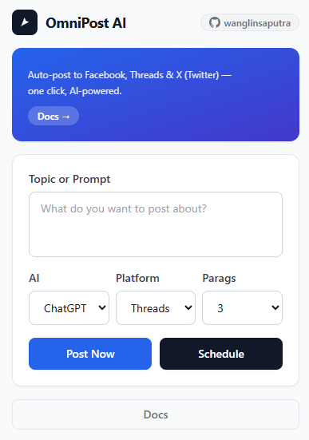

# OmniPost AI

<p align="center">
  
</p>

Chrome extension for multi-platform auto-posting. AI-powered (ChatGPT / Gemini) content generation with one-click publish to Facebook, Threads, and X (Twitter).

## Features

- **AI Content Generation** -- pick ChatGPT or Gemini, describe your topic, AI writes the post
- **Multi-Platform** -- post to Facebook, Threads, and X (Twitter) from a single popup
- **Thread Scheduling** -- set date and time for Threads posts (uses chrome.alarms)
- **Multi-Paragraph Threads** -- configure 1-5 paragraphs for Threads
- **No API Keys Required** -- works with your existing browser login sessions

### Extension

```
extension/
  manifest.json           Chrome extension manifest (MV3)
  vite.config.ts          Vite build config with CRXJS
  src/
    background/           Service worker (background.ts)
    content_scripts/      Content scripts for AI and social platforms
      platforms/          Per-platform posting logic (facebook.ts, threads.ts, x.ts)
    popup/                Extension popup UI (index.html, popup.ts, style.css)
    utils/                Shared types, selectors, Supabase client
```

## Development

### Extension

```bash
cd extension
npm install
npm run dev       # watch mode with hot reload
npm run build     # production build -> dist/
```

## Build Output

Extension build produces a `dist/` folder ready for Chrome loading:
1. Open Chrome -> chrome://extensions
2. Enable Developer mode
3. Load unpacked -> select `extension/dist/`

## Platform Support

| Platform  | Post Type        | Schedule | Paragraph Count |
|-----------|------------------|----------|-----------------|
| Threads   | Multi-paragraph  | Yes      | 1-5             |
| Facebook  | Single post      | No       | N/A             |
| X (Twitter) | Single tweet   | No       | N/A (280 chars) |

## Links

- [Documentation](https://omnipost.codeworks.web.id/)
- [GitHub](https://github.com/wanglinsaputra/OmniPost-AI)

## Disclaimer

OmniPost AI disediakan untuk tujuan edukasi dan produktivitas pribadi. Developer tidak bertanggung jawab atas penyalahgunaan, termasuk namun tidak terbatas pada: spam, pelanggaran ToS platform, konten ilegal, atau pelanggaran hak cipta. Gunakan dengan bijak dan patuhi aturan masing-masing platform.

## Licensi

[MIT](LICENSE)
